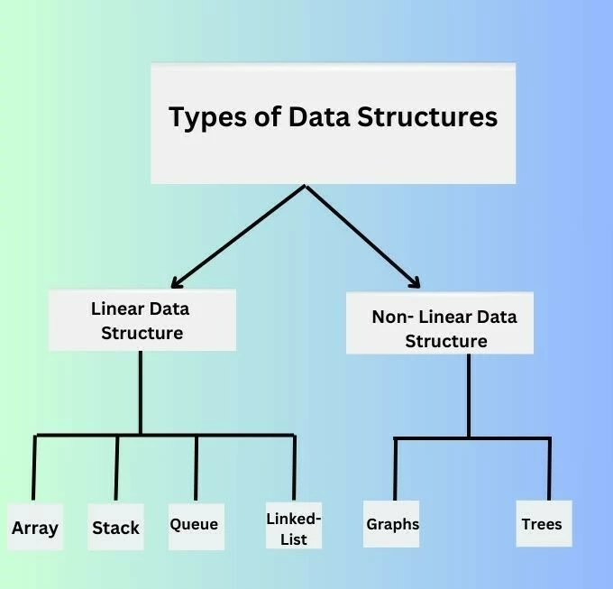

# DSA-Supreme-Batch
# Types of Data Structures
Data structures are broadly classified into two categories:

  
## Primitive Data Structures
Primitive data structures are the basic building blocks used to create more complex structures. They include:
•	Integers: Whole numbers.
 
•	Floats: Decimal numbers.
 
•	Characters: Single symbols or letters.
 
•	Booleans: True or false values.

## Non-Primitive Data Structures
Non-primitive data structures are more complex and can be divided into two types:

###	Linear Data Structures: Elements are arranged in a linear sequence.
 
### Non-Linear Data Structures: Elements are arranged in a hierarchical or network-like structure.
